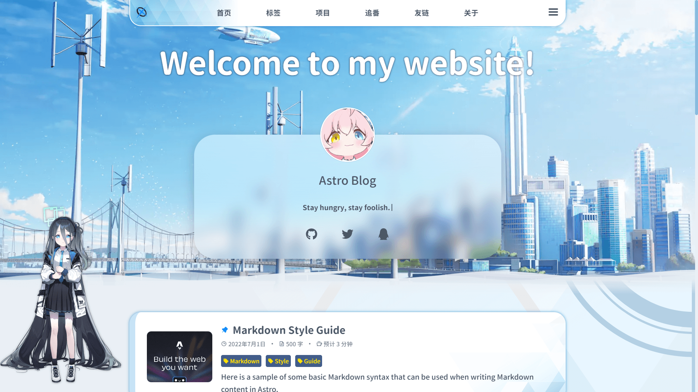
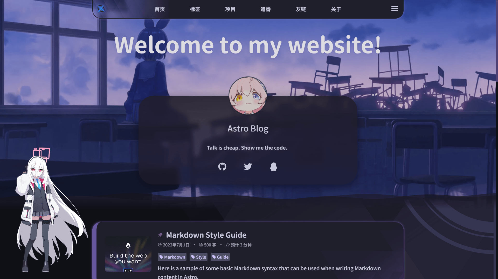

# AronaNote


基于 Astro 构建的个人博客主题，灵感来自 Blue Archive 游戏风格。

**预览**: [arona-note.netlify.app](https://arona-note.netlify.app)

**亮色模式：**



**暗色模式：**




## 功能特性

- [x] 首页横幅 Banner
- [x] 文章列表展示
- [x] 标签分类系统
- [x] 全文搜索功能
- [x] Waline 评论系统
- [x] 代码高亮与行号显示
- [x] 手机端响应式适配
- [x] LaTeX 数学公式支持
- [x] 点击烟花效果
- [x] 底栏信息展示
- [x] 优化 404 页面
- [x] Spine 模型动画（Arona / Plana / Kei / Aris）
  - [x] 点击语音播放
  - [x] 复制事件提示
  - [x] 移动端自动隐藏
  - [x] 桌面端透明度优化
  - [x] 滚动到页脚自动抬升
- [x] 首屏加载动画
- [x] 夜间模式切换
- [x] RSS 订阅
- [x] 站点地图Sitemap生成
- [x] 图片灯箱浏览
- [x] 阅读时间估算
- [x] 友链页面
- [x] 项目展示页面
- [x] 背景音乐播放（Howler.js + 随机曲库）
- [x] 文章目录导航 (TOC)
  - [x] 桌面端侧边栏固定
  - [x] 移动端底部弹窗
- [x] PWA 支持（离线访问、自动更新）
- [x] 键盘快捷键（`/` 打开搜索，`Esc` 关闭）
- [x] Open Graph / SEO 优化
- [x] 文章置顶功能（在 frontmatter 中设置 `pinned` 数值）
- [x] 图片懒加载
- [x] 文章阅读进度条
- [x] 路由跳转进度条（NProgress）
- [x] 追番页面（Bilibili 番剧追踪）

## 技术栈

- **框架**: [Astro](https://astro.build/) - 高性能静态站点生成器
- **UI 框架**: [Vue 3](https://vuejs.org/) - 渐进式 JavaScript 框架
- **样式**: [Less](https://lesscss.org/) - 动态样式语言
- **代码高亮**: [Expressive Code](https://expressive-code.com/) - 美观的代码块
- **数学公式**: [KaTeX](https://katex.org/) - 快速数学排版
- **评论系统**: [Waline](https://waline.js.org/) - 简洁安全的评论系统
- **图片浏览**: [PhotoSwipe](https://photoswipe.com/) - 触摸优化的图片灯箱
- **渲染引擎**: [PixiJS](https://pixijs.com/) - 高性能 2D WebGL 渲染器
- **动画模型**: [Spine](https://esotericsoftware.com/) - 2D 骨骼动画
- **音频引擎**: [Howler.js](https://howlerjs.com/) - Web Audio API 音频库
- **图标**: [Astro Icon](https://www.astroicon.dev/) + [Phosphor Icons](https://phosphoricons.com/) + [Font Awesome](https://fontawesome.com/)
- **PWA**: [@vite-pwa/astro](https://vite-pwa-org.netlify.app/frameworks/astro.html) - Astro PWA 插件
- **进度条**: [NProgress](https://ricostacruz.com/nprogress/) - 页面加载进度指示器
- **图片处理**: [Sharp](https://sharp.pixelplumbing.com/) - 高性能 Node.js 图像处理库
- **阅读时间**: [reading-time](https://github.com/ngryman/reading-time) - 文章阅读时间估算
- **YAML 解析**: [js-yaml](https://github.com/nodeca/js-yaml) - YAML 解析器和序列化器
- **追番集成**: [astro-bangumi](https://github.com/sf-yuzifu/astro-bangumi) - Bilibili 番剧追踪集成

## 快速开始

```bash
# 克隆项目
git clone <repository-url>
cd astro-blog

# 安装依赖
yarn install

# 启动开发服务器
yarn dev

# 构建生产版本
yarn build

# 预览生产构建
yarn preview
```

## 项目配置

配置文件位于 `config.yml`，包含以下主要配置项：

```yaml
# 站点基本信息
site:
  title: "Astro Blog"
  description: "Welcome to my website!"
  author: "Your Name"
  avatar: "/theme/banner/avatar.webp"
  favicon: "/favicon.svg"
  url: "https://example.com"
  lang: "zh-CN"
  # 备案信息（可选）
  icp:
    - text: "萌ICP备114514号"
      url: "https://icp.gov.moe/"
  # 社交链接
  social:
    - icon: "fa7-brands:github"
      url: "https://github.com/username"

# 导航菜单
nav:
  - name: "首页"
    url: "/"
  - name: "标签"
    url: "/tags/"
  - name: "项目"
    url: "/project/"
  - name: "追番"
    url: "/bangumi/"
  - name: "友链"
    url: "/friends/"
  - name: "关于"
    url: "/about/"

# 友链配置
friends:
  enable: true
  title: "友情链接"
  description: "与优秀的开发者们互相连接"
  list:
    - name: "Astro"
      url: "https://astro.build"
      description: "The web framework for content-driven websites"
      avatar: "https://astro.build/favicon.svg"

# 项目展示配置
projects:
  enable: true
  title: "我的项目"
  description: "开源作品与个人项目展示"
  list:
    - name: "Astro Blog"
      url: "https://github.com/withastro/astro"
      description: "使用 Astro 构建的个人博客网站"
      tags: ["Astro", "TypeScript"]
      icon: "ph:rocket-launch-bold"

# 评论系统
comments:
  enable: true
  type: "waline"  # 支持: waline
  waline:
    serverURL: "https://your-waline-server.vercel.app"

# 捐赠/赞助配置
sponsor:
  enable: true
  title: "喜欢这篇文章？打赏一下作者吧"
  description: "如果我的文章对你有帮助，欢迎赞赏支持"
  methods:
    - name: "微信"
      image: "/donate/donate.png"
      icon: "ph:wechat-logo-bold"
      color: "#07c160"

# 功能开关
features:
  search: true          # 搜索功能
  backToTop: true       # 返回顶部
  themeToggle: true     # 主题切换
  pageTransition: true  # 页面过渡动画
  readingTime: true     # 阅读时间估算

# Spine Live2D 角色配置
spine:
  enable: true
  voiceLang: "zh"  # zh (中文) 或 jp (日语)
  characters:
    arona:  # 亮色主题角色
      skelUrl: "/spine_assets/aris/aris_spr.skel"
      atlasUrl: "/spine_assets/aris/aris_spr.atlas"
      idleAnimationName: "Idle_01"
      eyeCloseAnimationName: "Eye_Close_01"
      rightEyeBone: "R_Eye_01"
      leftEyeBone: "L_Eye_01"
      frontHeadBone: "Head_01"
      backHeadBone: "Head_Back"
      eyeRotationAngle: 76.307
      voiceConfig:
        - audio: "/spine_assets/aris/audio/aris_01.ogg"
          animation: "10"
          text: "唔——肚子饿了。"
      copyConfig:  # 复制事件配置（可选）
        audio: "/spine_assets/aris/audio/aris_copy.mp3"
        animation: "07"
        text: "邦邦咔邦！复制了有用的知识呢！"
      # 位置偏移配置（可选，不配置则使用默认位置）
      offset:
        left: "0" # 水平位置偏移，支持 % 或 px
      #   bottom: "20px"  # 垂直位置偏移，支持 % 或 px
    plana:  # 暗色主题角色
      skelUrl: "/spine_assets/kei/CH0335_spr.skel"
      atlasUrl: "/spine_assets/kei/CH0335_spr.atlas"
      idleAnimationName: "Idle_01"
      eyeCloseAnimationName: "Eye_Close_01"
      rightEyeBone: "R_Eye_01"
      leftEyeBone: "L_Eye_01"
      frontHeadBone: "Head_Rot"
      backHeadBone: "Head_Back"
      eyeRotationAngle: 97.331
      voiceConfig:
        - audio: "/spine_assets/kei/audio/kei_01.ogg"
          animation: "17"
          text: "请别说我可爱啦！"
      copyConfig:
        audio: "/spine_assets/kei/audio/kei_copy.ogg"
        animation: "07"
        text: "我能帮上忙吗？"
      # 位置偏移配置（可选，不配置则使用默认位置）
      # offset:
      #   left: "5%"      # 水平位置偏移，支持 % 或 px
      #   bottom: "20px"  # 垂直位置偏移，支持 % 或 px

# 一言/座右铭配置
hitokoto:
  enable: true
  list:
    - "生活不止眼前的苟且，还有诗和远方。"
    - "Stay hungry, stay foolish."

# 背景音乐配置
music:
  # 是否启用（需要 features.music 也为 true）
  enable: true
  # 音乐 API 地址，{id} 会被替换为歌曲 ID
  api: "https://your-music-api.com/song/{id}"
  # 曲库歌曲 ID 列表（随机播放）
  songIds:
    - 12345678
    - 87654321
  # 音量（0-1，默认 0.3）
  volume: 0.3
  # 音乐 URL 在返回 JSON 中的字段路径，用 . 分隔层级
  urlField: "data.url"

# 追番配置
bangumi:
  # 是否启用
  enable: true
  # 页面配置
  page:
    title: "我的追番"
    description: "追番快乐！我收藏的番剧都在这里"
  # 集成配置
  integration:
    vmid: "你的Bilibili UID"  # Bilibili UID
    title: "追番列表"
    lazyload: true
    coverMirror: ""  # 图片镜像，解决403问题
    category: [1, 2]  # 1=番剧, 2=影视
  # 组件配置
  component:
    categoryFilter: "all"  # 'all' | '1' | '2'
    show: 1  # 0=想看, 1=在看, 2=看过
    title: ""
    quote: ""
    darkSelector: "html:not([theme='dark'])"
```

## 文章配置

在文章 Frontmatter 中可以配置以下选项：

```markdown
---
title: 文章标题
description: 文章描述
date: 2024-01-01
tags:
  - 标签1
  - 标签2
image: /blog-placeholder-1.jpg  # 封面图片
pinned: 1  # 置顶等级，数值越大越靠前
---

文章摘要，会显示在文章列表中

---

正文内容...
```

## 资源文件

- **头像/背景**: `src/assets/theme/banner/`
  - `avatar.webp` - 站点头像
  - `banner.webp` - 首页背景
  - `banner_dark.webp` - 暗色模式首页背景
  - `bgm.mp3` - 背景音乐

- **Spine 模型**: `public/spine_assets/`
  - 支持 Arona、Plana、Kei、Aris 等角色模型

## 感谢

- [Astro](https://astro.build/) - 快速、内容驱动的网站框架
- [vitepress-theme-bluearchive](https://github.com/Alittfre/vitepress-theme-bluearchive) - 本主题的设计灵感来源
- [vitepress-theme-sakura](https://github.com/flaribbit/vitepress-theme-sakura) - 提供参考
- [spine-runtimes](https://github.com/esotericsoftware/spine-runtimes) - Spine 动画运行时
- [Resource Han Rounded](https://github.com/CyanoHao/Resource-Han-Rounded) - 字体资源
- [hexo-bilibili-bangumi](https://github.com/HCLonely/hexo-bilibili-bangumi) - 追番功能灵感来源

## License

[MIT](LICENSE)
